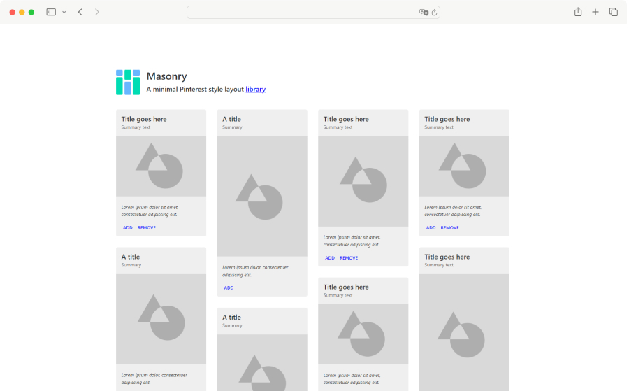

[](https://hellraiserrob.github.io/masonry)

# Masonry

An example of a beautiful Pinterest style layout library, available for you to take and use as you wish in your projects.

[Demo](https://hellraiserrob.github.io/masonry/)

[](https://hellraiserrob.github.io/masonry)

## Features

- Vanilla Typescript
- Light & Responsive
- Use in your projects or as learning material

## Setup

Pass a Breakpoint[] to configure the columns and gutter for different breakpoints

|             | Description | Type    | 
| ----------- | ----------- | ------- | 
| thresold    | The pixel >= this should apply to  | number |
| columns    | The number of columns  | number |
| gutter    | The pixel gap between the cards  | number |

e.g.

```javascript
const options:Breakpoint[] = [
  {
    threshold: 0,
    columns: 1,
    gutter: 32,
  },
  {
    threshold: 600,
    columns: 3,
    gutter: 32,
  },
  {
    threshold: 1000,
    columns: 4,
    gutter: 32,
  }
];

setup(options)
```
